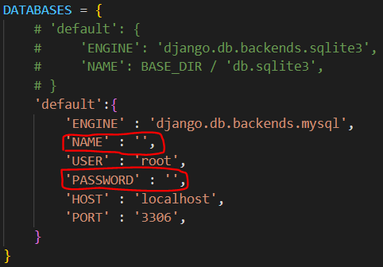

# 저시력 장애인을 위한 상품 인식 시스템

> 과자 이미지를 업로드하면, 어떤 과자인지 알려주고 과자의 가격과 부가 정보들까지 안내하는 기능을 구현하였다. 
---

## 구현 프로세스

1. core/settings.py의 DATABASES 부분을 수정하여야 한다.
   - MySQL 안의 DB에 과자 정보들을 저장해놓고 서버 사용 시 필요한 정보들을 가져오는 방식이다.
   - 내 개인 MySQL을 활용한 방식이라 MySQL을 사용한다면 아래 이미지의 빈란에 자신이 사용하는 db의 이름, MySQL 비밀번호를 입력해야 한다.
     - SQLite 사용한다면 설정만 제대로 하고 그대로 사용해도 상관없다.
   - 

2. 아래의 순서대로 터미널 창에 코드 입력
    ```bash
    $ py manage.py migrate core # DB model 변동 선언

    $ py manage.py make migrations # SQL 서버에 이를 반영
    ```
3. [nutrition.csv](nutrition.csv)와 [snack.csv](snack.csv) 파일에 입력된 데이터가 있으므로, 데이터 일일이 입력할 필요 없이 이 파일을 업로드하면 된다.
- migration이 제대로 되었다면 DB 안에 각 테이블명이 core_nutrition, core_snack으로 형성되어 있을 것이므로, 그 안에 업로드하면 된다.

4. 서비스 시작하기 
    ```bash
    $ py manage.py runserver
    ```